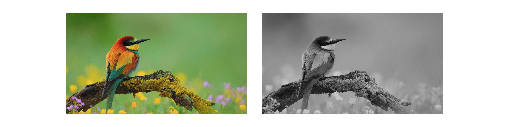
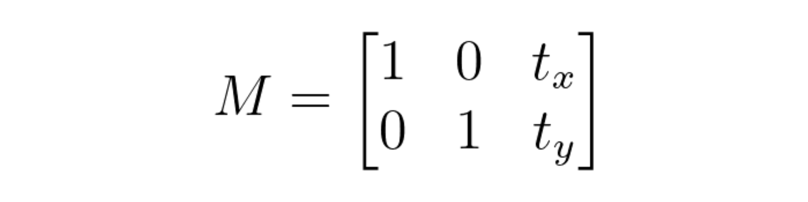
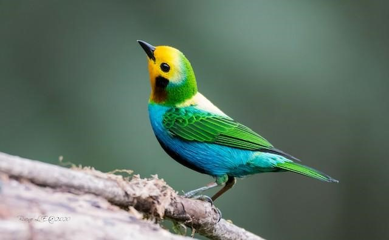
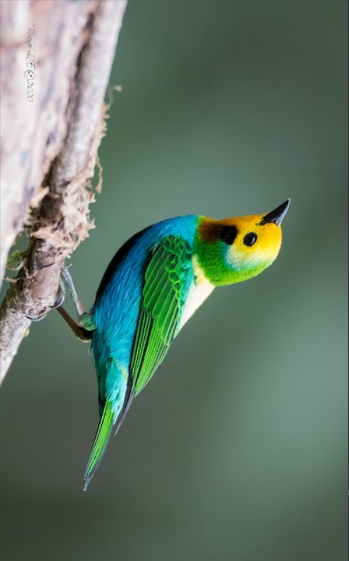

# Features of OpenCV Library

- **You can achieve the following with the help of the OpenCV library:**
    - Image reading and writing.
    - Video capture and storage.
    - Image processing (filter, transform, etc.)
    - Make a feature detection.
    - Identify specific items in films or photos, like people, eyes, and cars.
    - Analyze the video by estimating its motion, removing the backdrop, and tracking the items in it.

OpenCV was initially developed in C++. In addition to it, Python and Java bindings were provided. OpenCV is compatible with a variety of operating systems, including Windows, Linux, OS X, FreeBSD, NetBSD, OpenBSD, and others.

## Basic Operations with OpenCV

- **Loading the image:**

    cv2.IMREAD_COLOR: It specifies to load a colour image. Any transparency of the image will be neglected. It is the default flag. Alternatively, we can pass integer value 1 for this flag.

    cv2.IMREAD_GRAYSCALE: It specifies loading an image in grayscale mode. Alternatively, we can pass integer value 0 for this flag.

    ```python
    import cv2
    Img = cv2.imread (“bird.jpg”,1) # Colored Image
    Img_1 = cv2.imread (“bird.jpg”,0) # Black and White (grayscale)
    ```

    

- **Displaying the Image:**

    To load an image from the drive and show it using OpenCV, you must first execute the cv2. misread function with the path to your picture as the only input. Then, a call to cv2. imshow will display your image on your screen.

    ```python
    import cv2
    Img = cv2.imread (“Penguins.jpg”,1) # Black and White (gray scale)
    cv2.imshow(“Penguins”, img)
    cv2.waitKey(0)
    # cv2.waitKey(2000)
    cv2.destroyAllWindows()
    ```

- **Resizing the Image:**

    To resize a picture, scale it along each axis (height and width), considering the specified scale factors or just set the desired height and width.

    - **When resizing an image:**
        - It's crucial to remember the image's original aspect ratio (width by height) if you wish to retain it the same in the scaled version.
        - If you want to shrink the size of an image, you'll have to resample the pixels.

    ```python
    import cv2
    img = cv2.imread (“Penguins.jpg”,0) # Black and White (Gray Scale)
    resized_image = cv2.resize(img, (650,500))
    cv2.imshow(“Penguins”, resized_image)
    cv2.waitKey(0)
    cv2.destroyAllWindows()
    ```

## Functions and Use-cases

- **There are so many functions present in OpenCV for image processing. Now we will learn various operations we can perform on the image for image processing one by one.**
    - Grayscaling
    - Image Translations
    - Scaling and Cropping
    - Edge detection, Sharpening, Thresholding, Erosion and Dilation
    - Image Rotation, Arithmetic and bitwise Operations, etc.

### Grayscaling

Grayscaling is the conversion of a picture from RGB, CMYK, HSV, and other colour formats to shades of grey. For Grayscaling operation cv2.cvtColor() this function is used.

- **Applications of Grayscaling:**
    - There are a number of algorithms that can be tailored to only function with grayscaled photos, for example. The pre-implemented Canny edge detection function in the OpenCV library only works on grayscaled pictures.
    - Because RGB images have three channels and grayscaled images only have one, there is a dimensional reduction in grayscale images.

### Image Translations

Image translation represents the process of shifting an image from one location to another location. This can be performed using a transformation matrix. To perform image translation with OpenCV, we must first define an affine transformation matrix, which is a 2 x 3 matrix.



The tx and ty elements in the matrix represent picture shifting in the x and y directions, respectively. The cv2.wrapAffine() function to implement these translations. The numpy array must be of type float.

- **Applications of Image Translation:**
    - Cropping the image
    - Shifting of image.
    - Hiding part of the image.
    - Animation to the image by using loop to translation.

### Rotation

Rotation operation helps to rotate an image by some angle, Θ. Θ represents how many degrees (not radians) we are rotating an image. The image may be rotated at different angles (90,180,270 and 360). OpenCV computes the affine matrix, i.e. it does not retain the angle between the lines or the distances between the points, but does preserves the ratio of distances between points located on the lines. It helps to display the reflection of the image.

- **Syntax for rotating the image:**

    ```python
    import cv2
    cv2.cv.rotate(src, rotateCode[, dst])
    ```

    - Where the parameters used are —
        - src: It is the colour space of the image. needs to be changed.
        - rotateCode: It is an enum that specifies how the array should be rotated.
        - dst: It is the src image's output image.(same size and depth). It is an optional parameter.

        It returns an image as the return value

        

- **Code to rotate image 90 degrees clockwise:**

    ```python
    import cv2
    src = cv2.imread(r'C:\Users\91705\Bird.jpg')
    window_name = 'Image'
    image = cv2.rotate(src, cv2.cv2.ROTATE_90_CLOCKWISE)
    cv2.imshow(window_name, image)
    cv2.waitKey(0)
    ```

    

- **Applications of Rotation:**
    - It helps to display the reflection of the image.
    - Image can be aligned the way needed using rotation operation.

### Scaling

The scaling operation helps to resize the image. To resize an image in Python, we use cv2. resize() function of OpenCV library cv2. By default, resize only changes the width and height of the image. Based on the requirement, the aspect ratio can be preserved by calculating width or height for given target height or width respectively. The cv2.resize() method is used to resize an image along its width, height, or both dimensions while preserving or not retaining the aspect ratio.

- **The syntax of cv2.resize() function is:**

    ```python
    cv2.resize(src, dsize[, dst[, fx[, fy[, interpolation]]]])
    ```

    - Where the parameters used are —
        - src: represents the source, original or input image in the form of numpy array
        - dsize: represents the desired size of the output image, given as tuple
        - fx: represents the scaling factor along X-axis
        - fy: represents the scaling factor along Y-axis
        - interpolation could be one of INTER_NEAREST, INTER_LINEAR, INTER_AREA,INTER_CUBIC or INTER_LANCZOS4
- **Code to resize image:**

    ```python
    import cv2
    src = cv2.imread(r'C:\Users\91705\Bird.jpg', cv2.IMREAD_UNCHANGED)
    scale_percent = 50
    width = int(src.shape[1] * scale_percent / 100)
    height = int(src.shape[0] * scale_percent / 100)
    dsize = (width, height)
    output = cv2.resize(src, dsize)
    cv2.imwrite(r'C:\Users\91705\Bird.jpg',output)
    ```

- **Resizing Horizontally:**

    ```python
    import cv2
    src = cv2.imread(r'C:\Users\91705\Bird.jpg', cv2.IMREAD_UNCHANGED)
    new_width = 300
    dsize = (new_width, src.shape[0])
    output = cv2.resize(src, dsize, interpolation = cv2.INTER_AREA)
    cv2.imwrite(r'C:\Users\91705\Bird.jpg',output)
    ```

- **Resizing Vertically:**

    ```python
    import cv2 
    src = cv2.imread(r'C:\Users\91705\Bird.jpg', cv2.IMREAD_UNCHANGED)
    new_height = 200
    dsize = (src.shape[1], new_height)
    output = cv2.resize(src, dsize, interpolation = cv2.INTER_AREA)
    cv2.imwrite(r'C:\Users\91705\Bird.jpg',output)
    ```

- **Applications of Scaling:**
    - It is used to fit one image into another image.
    - Scaling can be helpful when using a large dataset as using the pictures would be easier.

### Cropping

The cropping operation enables us to select the part of the image in which we are interested. It is an act of *selecting* and *extracting* the Region of Interest (ROI).

OpenCV images are opened as NumPy arrays. We can use NumPy array slicing to crop an image because each image is a NumPy array. All we're doing here is slicing arrays. We initially provide the slice with the startY and endY coordinates, followed by the startX and endX coordinates. like: output=image[startY:endY, startX:endX] The startY:endY slice provides our rows (since the y-axis is our number of rows) while startX:endX provides our columns.

```python
import numpy as np
>>> I = np.arange(0, 25)
>>> I
array([ 0,  1,  2,  3,  4,  5,  6,  7,  8,  9, 10, 11, 12, 13, 14,
      15, 16, 17, 18, 19, 20, 21, 22, 23, 24]
>>> I = I.reshape((5, 5))
>>> I
array([[ 0,  1,  2,  3,  4],
      [ 5,  6,  7,  8,  9],
      [10, 11, 12, 13, 14],
      [15, 16, 17, 18, 19],
      [20, 21, 22, 23, 24]])
>>> I[0:3, 0:2]
array([[ 0,  1],
      [ 5,  6],
      [10, 11]])
```

- **Applications of Cropping:**
    - **It is used to remove the unwanted part of the image.
    - It can be used to focus on important part of the image

### Edge Detection

The built-in function cv2.Canny() in OpenCV takes our input image as the first argument and its aperture size (min and max value) as the second and third arguments. John F. Canny was the one who came up with the idea.

- **Applications of Edge Detection:**

    If we look in any beginner image processing projects, we'll almost certainly find the Canny edge detector being used somewhere. Whether we're measuring the distance between our camera and an object, creating a document scanner, or detecting a Game Boy screen in an image, the Canny edge detector is frequently used as a pre-processing step.

### Sharpening or Filtering

The Filter2D operation is used to convolve the kernel with an image. The Filter2D() method of the imgproc class can be used to perform this operation on an image.

### Thresholding

Thresholding is an OpenCV technique that involves assigning pixel values in relation to a threshold value. A threshold is a value that has two regions on either side, one below the threshold and the other above it. Each pixel value is compared to the threshold value in thresholding. It is set to 0 if the pixel value is less than the threshold, otherwise to the maximum value.

- Various Simple Thresholding Techniques:
    - cv2.THRESH_BINARY: If the pixel intensity exceeds the set threshold, set value to 255; otherwise, set value to 0. (black). The inverted or opposite case of cv2.THRESH_BINARY is cv.THRESH_BINARY_INV.
    - cv.THRESH_TRUNC: If the pixel intensity value exceeds the threshold, it is truncated to that value. The threshold is set to the same value as the pixel values. The rest of the values stay the same.
    - cv.THRESH_TOZERO: For all pixels with an intensity less than the threshold value, the intensity is set to 0.
    The inverted or opposite case of cv2.THRESH_TOZERO is cv.THRESH_TOZERO INV.
- **Applications of Erosion and Dilation:**
    - Thresholding is a widely used segmentation technique for distinguishing between foreground and background objects.
    - In Computer Vision, this technique of thresholding is done on grayscale images. As a result, the image must be converted to grayscale colour space first.

### Erosion and Dilation

Morphological operations are a group of operations used to process images based on their shapes. They generate an output image by applying a structuring element to an input image. Erosion and Dilation are the two most basic morphological operations. cv2.erode()  dilutes the features of an image by eroding the boundaries of the foreground object. cv2.dilate() enlarges the object's surface area, allowing it to highlight specific features.

- **Applications of Erosion and Dilation:**
    - Erosion —
        - It is useful for removing small white noises.
        - Used to detach two connected objects etc.
    - Dilation —
        - In cases like noise removal, erosion is followed by dilation. Erosion removes white noises, but it also shrinks our objects. So, we dilate it. Since the noise is cleard, they won’t come back, but our object area increases.
        - It is also useful in joining broken parts of an object.
