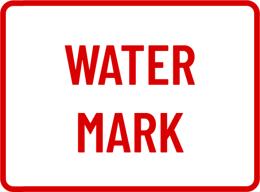
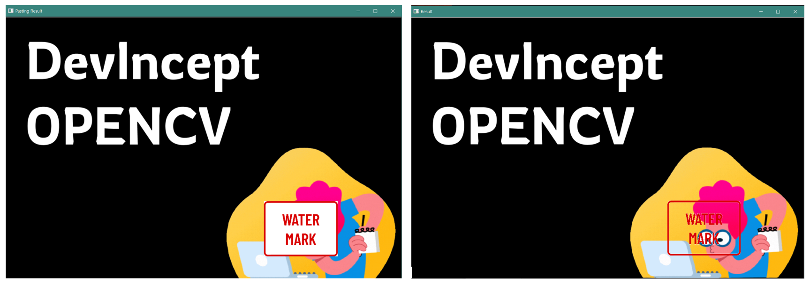

# BLENDING & PASTING IMAGES USING OPENCV

Blending and Pasting operations are commonly referred to as Basic Arithmetic Operations because OpenCV is performing some common math with the pixels for the final effect. 

We will be focussing mainly on performing Blending and Pasting operations using OpenCV. These operations are used to mix two images or to simply put one image on top of another. They are usually performed using Grphic Designing tools like Adobe Illustrator, Photoshop, etc. but here, using OpenCV we will learn how to automate this process.

Images used in the code:

&nbsp;


&nbsp;


&nbsp;

---
&nbsp;
### **PASTING IMAGES**:

Pasting is simply overlaying one image on top of the other.

Steps to perform pasting of images:
- Load and resize the images accordingly
- Get the Region of Interest or ROI (where on the original image the second image needs to be pasted)
- Replace the pixel values of ROI on the main image with the pixel values of the second image

```py
import numpy as np
import cv2

bg = cv2.imread(r'C:\Users\hp\bg.png') 
wm = cv2.imread(r'C:\Users\hp\watermark.png') 
print (bg.shape)
print (wm.shape)

cv2.imshow("Original Image", bg) 
cv2.waitKey(0) 
cv2.imshow("Original Watermark", wm)
cv2.waitKey(0) 

wm = cv2.resize(wm,(200,150))
cv2.imshow("Resized Watermark", wm)
cv2.waitKey(0) 

x_offset = 50
y_offset = 520

x_end = x_offset + wm.shape[1]
y_end = y_offset + wm.shape[0]

bg[y_offset:y_end,x_offset:x_end] = wm
cv2.imshow("Pasting Result", bg)  
cv2.waitKey(0) 
```

&nbsp;

---
&nbsp;

### **BLENDING IMAGES**

Blending is the mixing of two images on top of each other.

The cv2.addWeighted() function is used to perform this operation. this function takes both images as parameters, assigns certain weights to each image pixel, adds them and gives a single resulted image as the output. This will display transparency of the overlayed image.
The cv2.addWeighted() function takes 2 other parameters, alpha and beta which determine the importance each image gets in the final image.
For example, if alpha is 0.5 and beta is 0.5, then both images will be shown equally in the final output image. But if alpha is 0.8 and beta is 0.2, then the first image will be more prominent in the final output image.

- Images of same size are easier to blend
- Blending for images of varying sizes involves three stages: selecting, masking and overlaying

&nbsp;
### 1. Blending Images of the same size:
Steps for blending:
- Load the images and resize both images to the same size
- Determine alpha and beta values
- And use the cv2.addWeighted() function with both images along with alpha and beta
```py
import numpy as np
import cv2

bg = cv2.imread(r'C:\Users\hp\bg.png') 
wm = cv2.imread(r'C:\Users\hp\watermark.png') 
print (bg.shape)
print (wm.shape)

cv2.imshow("Original Image", bg) 
cv2.waitKey(0) 
cv2.imshow("Original Watermark", wm)
cv2.waitKey(0) 

img1 = cv2.resize(bg,(800,600))
img2 = cv2.resize(wm,(800,600))


cv2.imshow("Resized Image", img1)  
cv2.waitKey(0) 
cv2.imshow("Resized Watermark", img2)  
cv2.waitKey(0) 

blended = cv2.addWeighted(img1, 0.5, img2, 0.5, 0)
cv2.imshow("Alpha Beta 0.5", blended)
cv2.waitKey(0) 

blended = cv2.addWeighted(img1, 0.8, img2, 0.2, 0)
cv2.imshow("Alpha 0.8 Beta 0.2", blended) 
cv2.waitKey(0) 

blended = cv2.addWeighted(img1, 1, img2, 1, 0)
cv2.imshow("Alpha Beta 1", blended)
cv2.waitKey(0) 
```
&nbsp;
### 2. Blending Images of different sizes:
The entire process of blending images of different sizes involves three essential stages. Steps for blending:
- Load both images and resize accordingly
- Create the ROI
- Build a mask to let only the ROI of the larger image to filter through to the next stage
- Build another mask to let only certain parts of the smaller image to filter through to the next stage
- Overlay/Paste the masked image onto the larger image

```py
import numpy as np
import cv2

img = cv2.imread(r'C:\Users\hp\bg.png') 
wm = cv2.imread(r'C:\Users\hp\watermark.png') 
print (img.shape)
print (wm.shape)

cv2.imshow("Original Image", img)  
cv2.waitKey(0) 
cv2.imshow("Original Watermark", wm)
cv2.waitKey(0) 

wm = cv2.resize(wm,(200,150))
cv2.imshow("Resized Watermark", wm)  
cv2.waitKey(0) 

x_offset = 700
y_offset = 500  

rows,columns,chanels = wm.shape
roi = img[y_offset:650, x_offset:900]

cv2.imshow("ROI", roi)  
cv2.waitKey(0) 

wmGrey = cv2.cvtColor(wm, cv2.COLOR_RGB2GRAY)
cv2.imshow("Greyscaled Watermark", wmGrey)  
cv2.waitKey(0) 

ret, mask = cv2.threshold(wmGrey, 120, 255, cv2.THRESH_BINARY)
cv2.imshow("Masked Watermark", mask)  
cv2.waitKey(0) 

bg = cv2.bitwise_or(roi,roi,mask = mask)
cv2.imshow("Resulting Watermark", bg)  
cv2.waitKey(0) 

maskInv = cv2.bitwise_not(wmGrey)
cv2.imshow("inverted Mask", maskInv)  
cv2.waitKey(0) 

fg = cv2.bitwise_and(wm,wm, mask=maskInv)
cv2.imshow("Resulting Watermark", fg)  
cv2.waitKey(0) 

final_roi = cv2.add(bg,fg)
cv2.imshow("Watermark on ROI", final_roi)  
cv2.waitKey(0) 

wm1 = final_roi

img[y_offset : y_offset + wm1.shape[0], x_offset : x_offset + wm1.shape[1]] = wm1
cv2.imshow("Result", img)  
cv2.waitKey(0) 
```

&nbsp;

---
&nbsp;

### **PASTING VS BLENDING**
&nbsp;
               



&nbsp;

---
&nbsp;

### **APPLICATIONS**:

- Graphic Designing on a large scale
- Logo Placement
- Internet Meme Generation
- Watermarking a huge number of images
