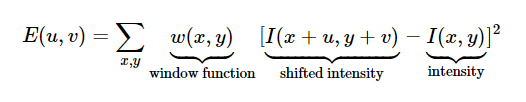

# CORNER DETECTION

&nbsp;
## **UNDERSTANDING FEATURES**
Features in images are matching points between frames of an environment which define certain characteristics of that environment. These characteristics help in easy recognition of the environment. Features are uniquely recognizable, i.e. features of one environment are only unique to that environment.

There are 3 main types of features:
1. Edges
1. Corners (points of interest)
1. Blobs (regions of interest)

&nbsp;


## **CORNERS**

### **What are Corners?**
Regions in the image with large variation in pixel intensity in all the directions are known as Corners. A corner is nothing but the intersection of two edges. This intersection or Corner is the point where the directions of both the edges change.

&nbsp;
### **Why Corner Detection?**
For the simple reason of Feature Extraction of course!

&nbsp;
### **Where is Corner Detection used?**
+ Motion Object tracking
+ 3D Modelling
+ Detecting and Recognizing Objects, Shapes, etc.

&nbsp;
### **How to perform Corner Detction?**
There are 2 most commonly used techniques:
   1. [Harris Corner Detection](#harris-corner-detection)
   1. [Shi-Tomasi Corner Detection](#shi-tomasi-corner-detection)


&nbsp;

#### **HARRIS CORNER DETECTION**

This method was formulated by  Chris Harris & Mike Stephens in their paper ***A Combined Corner and Edge Detector*** in 1988. 
They came up with a simple mathematical formula to identify the pixels with large variation in intensities in all directions.

**Formula:**  



**References:**
1. https://docs.opencv.org/4.5.2/dc/d0d/tutorial_py_features_harris.html
1. https://www.youtube.com/watch?v=KH8Mq9FPVPw

&nbsp;

**Using cv.cornerHarris():**

This function uses the above formula to find the Corners in the Input image. It takes 4 parameters:
1. img - Input image. It should be grayscale and float32 type
1. blockSize (int) - It is the size of neighbourhood considered for corner detection
1. ksize (int) - Aperture parameter of the Sobel derivative used (should be odd and not more than 31)
1. k (float)- Harris detector free parameter in the equation

```py
import numpy as np
import cv2 

img = cv2.imread(r'C:\Users\hp\Desktop\DEVINCEPT\Corner\bg.png')
cv2.imshow('Original Image',img)
cv2.waitKey(0)

grayImg = cv2.cvtColor(img,cv2.COLOR_BGR2GRAY)
grayImg = np.float32(grayImg)
CornerDet = cv2.cornerHarris(grayImg,2,3,0.02)

## result is dilated for marking the corners
CornerDet = cv2.dilate(CornerDet,None)

## 0.01 threshold for an optimal value
img[CornerDet>0.01*CornerDet.max()] = [0,0,255]

cv2.imshow('Corners Detected Image',img)
cv2.waitKey(0)
```

&nbsp;

#### **SHI-TOMASI CORNER DETECTION**

This method is a modified version of the Harris Corner Detection method. In 1994, J. Shi and C. Tomasi made a modification to it in their paper ***Good Features to Track*** which shows better results compared to Harris Corner Detector.

**References:**
1. https://docs.opencv.org/4.5.2/d4/d8c/tutorial_py_shi_tomasi.html
1. https://www.youtube.com/watch?v=XJXWOqvj1So

&nbsp;

**Using cv.goodFeaturesToTrack():**

This function finds N strongest corners in the image by Shi-Tomasi method.

It takes 4 parameters:
1. img - Input image. It should be grayscale 
1. No. of corners  (int)
1. Quality level (float) - value between 0-1 (minimum quality of corner)
1. Minimum euclidean distance between corners detected (float)

WORKFLOW OF THE FUNCTION:
1. Find all corners 
1. Reject corners below the quality level
1. Sort the remaining corners in descending order based on their quality 
1. Pick the first strongest corner and discard all the corners that fall in the range of the minimum distance 
1. Return all the remaining corners

```py
import numpy as np
import cv2 

img = cv2.imread(r'C:\Users\hp\Desktop\DEVINCEPT\Corner\bg.png')
cv2.imshow('Original Image',img)
cv2.waitKey(0)

grayImg = cv2.cvtColor(img,cv2.COLOR_BGR2GRAY)
CornerDet = cv2.goodFeaturesToTrack(grayImg,100,0.07,10)
Corners = np.int0(CornerDet)
for i in Corners:
    x,y = i.ravel()
    cv2.circle(img,(x,y),3,(0,0,255),-1)
    
cv2.imshow('Corners Detected Image',img)
cv2.waitKey(0)
```


