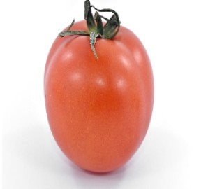
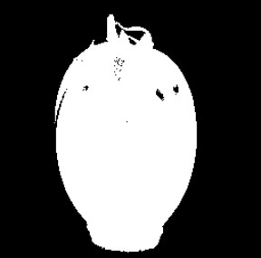
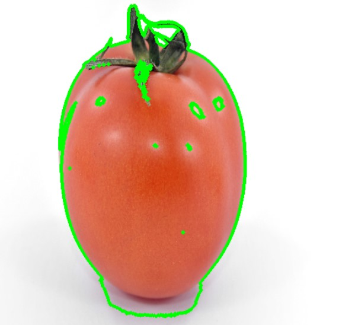
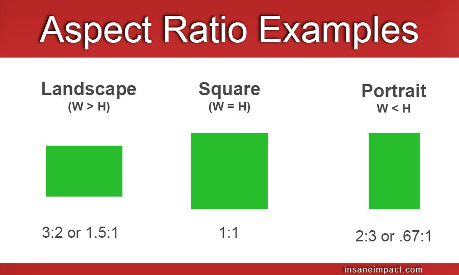
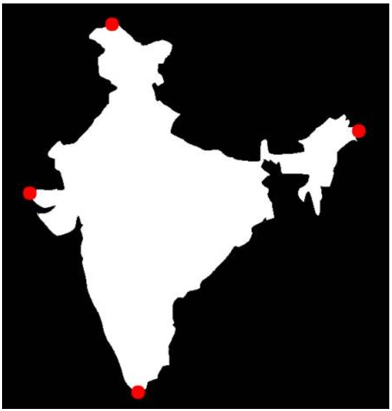

# Contours

##### Objectives and Outcomes

In this article, you will learn how to find and draw contours along with the implementation of some of the handy contour features and functions.


### What are Contours?

A **contour line** is simply a curve line that joins all the continuous points (along the boundary) that have the same values or the same intensities. Basically, contour can be defined as an outline or a border of  any object.

> Note: Do not confuse contours with edges. Edges lies in a local range: they only point out the difference between the neighbouring pixels. Contours are often obtained from **edges**, but they need to be closed curves. Think of them as boundaries.


### Uses of contours

Contours are mainly used for object detection. It can be used used to determine **size**, **shape**, and **area** of an object. Contour lines are also used in topographic maps to determine elevations. Contour maps plays a vital role in any types of engineering work and some of its functionalities range from **shape analysis** to **object detection** and **recognition**.


### To find contours

To find contours with better accuracy, it is recommended to use binary images. In OpenCV, finding contours is like finding a contrast between two colours, like finding  a white object from black background. 

This can be easily done by converting the image to grayscale by using-

```python
img_gray = cv2.cvtColor(image_name, cv.COLOR_BGR2GRAY)
```

and then applying threshold or canny edge detection by using-

```python
a = img_gray.max()  
_, thresh = cv2.threshold(img_gray, a/2+60, a,cv2.THRESH_BINARY_INV)
```

 Lets test this on a tomato

```python
import numpy as np
import cv2 
im = cv2.imread('tomato.jpg')
im=cv2.resize(im,(256,256))
imgray = cv2.cvtColor(im, cv.COLOR_BGR2GRAY)
# ret, thresh = cv.threshold(imgray, 127, 255, 0)
a = imgray.max()  
_, thresh = cv2.threshold(imgray, a/2+60, a,cv2.THRESH_BINARY_INV)
```

<p float="center">
  
   
</p>

Now, the syntax for **finding** contours is simply,

```python
contours, hierarchy = cv.findContours(thresh, cv.RETR_TREE, cv.CHAIN_APPROX_SIMPLE)
```

*Contours* in Python is a ***list*** of contours of an object, which can be an image, a frame from a video and so on. Each *Contour* in the list *Contours* is a point represented as (x , y) which represents the position of the point on a 2d map.


### How to draw the Contours?

***cv.drawContours*** function is used to draw contours. It can also be used to draw any shape by giving their boundary points. First argument is the source image, second image is the list of contours and third argument is index of contours (To draw all contours, pass -1). Remaining arguments would be rgb color information, thickness, etc.

- To draw all the contours in an image:

  ```python
  cv2.drawContours(img, contours, -1, (0,255,0), 3)
  ```

  The above example looks like -

   

- To draw an individual contour in an image, say 1st contour:

  ```python
  cv2.drawContours(img, contours, 0, (0,255,0), 3) 
  #'0' in third positon indicates first index
  ```

  

### Contour Approximation Method

This is the third argument in ***cv.findContours*** function. 

If we pass **cv.CHAIN_APPROX_NONE** , all the boundary points are stored. But sometimes, we dont really need all the boundary points. For example, if we want to represent a line, we only need the first and last point. This is what **cv.CHAIN_APPROX_SIMPLE** does. It removes all the redundant points, thus saving memory.


# Contour-features

### 1- Moments

Image moments help you to calculate some features like center of mass of the object, area of the object etc. 
The function cv.moments() gives a dictionary of all moment values calculated.

```python
import numpy as np
import cv2 as cv
img = cv.imread('star.jpg',0)
ret,thresh = cv.threshold(img,127,255,0)
contours,hierarchy = cv.findContours(thresh, 1, 2)
cnt = contours[0]
M = cv.moments(cnt)
print( M )
```

- From this moments, you can extract useful data like area, centroid etc.

```python
cx = int(M['m10']/M['m00'])
cy = int(M['m01']/M['m00'])
```

### 2- Contour Area

Contour area is given by the function cv.contourArea() or from moments, M['m00'].

```python
area = cv.contourArea(cnt)
```

### 3- Contour Perimeter

It is also called arc length. It can be found out using cv.arcLength() function. Second argument specify whether shape is a closed contour (if passed True), or just a curve.

```python
perimeter = cv.arcLength(cnt,True)
```

### 4- Contour Approximation

It approximates a contour shape to another shape with less number of vertices depending upon the precision we specify. It is an implementation of Douglas-Peucker algorithm. 

To understand this, suppose you are trying to find a square in an image, but due to some problems in the image, you didn't get a perfect square, but a "bad shape". Now you can use this function to approximate the shape. In this, second argument is called epsilon, which is maximum distance from contour to approximated contour. It is an accuracy parameter. A wise selection of epsilon is needed to get the correct output.

```pyhton
epsilon = 0.1*cv.arcLength(cnt,True)
approx = cv.approxPolyDP(cnt,epsilon,True)
```

Below, in second image, green line shows the approximated curve for epsilon = 10% of arc length. Third image shows the same for epsilon = 1% of the arc length. Third argument specifies whether curve is closed or not.


### 5- Convex Hull

Convex Hull will look similar to contour approximation, but it is not (Both may provide same results in some cases). Here, `cv.convexHull()` function checks a curve for convexity defects and corrects it. Generally speaking, convex curves are the curves which are always bulged out, or at-least flat. And if it is bulged inside, it is called convexity defects. For example, check the below image of hand. Red line shows the convex hull of hand. The double-sided arrow marks shows the convexity defects, which are the local maximum deviations of hull from contours.


There is a little bit things to discuss about it its syntax:

```python 
hull = cv.convexHull(points[, hull[, clockwise[, returnPoints]]
```
Arguments details:

- points are the contours we pass into.
- hull is the output, normally we avoid it.
- clockwise : Orientation flag. If it is True, the output convex hull is oriented clockwise. Otherwise, it is oriented counter-clockwise.
- returnPoints : By default, True. Then it returns the coordinates of the hull points. If False, it returns the indices of contour points corresponding to the hull points.

So to get a convex hull as in above image, following is sufficient:

```python
hull = cv.convexHull(cnt)
```

But if we want to find convexity defects, we need to pass returnPoints = False. To understand it, we will take the rectangle image above. First I found its contour as cnt. Now I found its convex hull with returnPoints = True, I got following values: [[[234 202]], [[ 51 202]], [[ 51 79]], [[234 79]]] which are the four corner points of rectangle. Now if do the same with returnPoints = False, I get following result: [[129],[ 67],[ 0],[142]]. These are the indices of corresponding points in contours. For eg, check the first value: cnt[129] = [[234, 202]] which is same as first result (and so on for others).

### 6- Checking Convexity
There is a function to check if a curve is convex or not, cv.isContourConvex(). It just return whether True or False. Not a big deal.

```python
k = cv.isContourConvex(cnt)
```

### 7. Bounding Rectangle

There are two types of bounding rectangles.

#### 7.a. Straight Bounding Rectangle

It is a straight rectangle, it doesn't consider the rotation of the object. So area of the bounding rectangle won't be minimum. It is found by the function cv.boundingRect().

Let (x,y) be the top-left coordinate of the rectangle and (w,h) be its width and height.

```python
x,y,w,h = cv.boundingRect(cnt)
cv.rectangle(img,(x,y),(x+w,y+h),(0,255,0),2)
```

#### 7.b. Rotated Rectangle

Here, bounding rectangle is drawn with minimum area, so it considers the rotation also. The function used is cv.minAreaRect(). It returns a Box2D structure which contains following details - ( center (x,y), (width, height), angle of rotation ). But to draw this rectangle, we need 4 corners of the rectangle. It is obtained by the function cv.boxPoints()

```python
rect = cv.minAreaRect(cnt)
box = cv.boxPoints(rect)
box = np.int0(box)
cv.drawContours(img,[box],0,(0,0,255),2)
```

Both the rectangles are shown in a single image. Green rectangle shows the normal bounding rect. Red rectangle is the rotated rect.


### 8- Minimum Enclosing Circle

Next we find the circumcircle of an object using the function cv.minEnclosingCircle(). It is a circle which completely covers the object with minimum area.

```python
(x,y),radius = cv.minEnclosingCircle(cnt)
center = (int(x),int(y))
radius = int(radius)
cv.circle(img,center,radius,(0,255,0),2)
````


### 9- Fitting an Ellipse

Next one is to fit an ellipse to an object. It returns the rotated rectangle in which the ellipse is inscribed.

```python
ellipse = cv.fitEllipse(cnt)
cv.ellipse(img,ellipse,(0,255,0),2)
```


### 10- Fitting a Line

Similarly we can fit a line to a set of points. Below image contains a set of white points. We can approximate a straight line to it.


# SOME IMPORTANT CONTOUR PROPERTIES

In this article, we'll see some of the important properties of Contour.

Here, we will cover some advanced Contour Properties like aspect ratio, extent, convex hull, and solidity.

### 1. Aspect Ratio

The definition of Aspect Ratio is given as 

aspect ratio = image width / image height ,i.e. it's simply the ratio of the image width to the image height.

Following is the code snippet for finding the aspect ratio in Python

```python
x,y,w,h = cv.boundingRect(cnt)
aspect_ratio = float(w)/h
```


Various examples of the different values of aspect ratios are shown in the figure below:



### 2. Extent

The definition of Extent is given as:

*extent = shape area / bounding box area* i.e., it is simply defined as the ratio of actual shape area and the area of the bounding box, where the bounding box area is given as follows:

*bounding box area = bounding box width x bounding box height*

Extent is always <1, as the shape area (in pixels) cannot be greater than that of the bounding box area.

```python
area = cv.contourArea(cnt)
x,y,w,h = cv.boundingRect(cnt)
rect_area = w*h
extent = float(area)/rect_area
```

### 3. Solidity

Solidity is defined as the  ratio of contour area to its convex hull area, i.e.:

*solidity = contour area / convex hull area*

Python Code for finding Solidity:

```python
area = cv.contourArea(cnt)
hull = cv.convexHull(cnt)
hull_area = cv.contourArea(hull)
solidity = float(area)/hull_area
```

The value of solidity cannot be greater than 1, as the number of pixels inside a shape cannot outnumber the number of pixels in the convex hull, because by definition, the convex hull is the smallest possible set of pixels enclosing the shape.

### 4.Equivalent Diameter

Equivalent Diameter is the diameter of the circle whose area is same as the contour area.

EquivalentDiameter=√(4×ContourArea/π)

Following is the code for finding the Equivalent Diameter using Python:

```python
area = cv.contourArea(cnt)
equi_diameter = np.sqrt(4*area/np.pi)
```

### 5. Orientation

Orientation is the angle at which object is directed.

Using the following line of code in Python, the orientation angle, Major and the Minor axes can be found out:

```python
(x,y),(MA,ma),angle = cv.fitEllipse(cnt)
```

### 6. Mask and Pixel Points

In order to find all the pixel points having an object, we use non-zero masks in a gray-scale image.

Following is the Python code for doing so:

```python
mask = np.zeros(imgray.shape,np.uint8)
cv.drawContours(mask,[cnt],0,255,-1)
pixelpoints = cv.findNonZero(mask)
```

### 7. Maximum Value, Minimum Value and their locations

We can use the `cv.minMaxLoc`to find the image locations with maximum and minimum values on a masked image, i.e.,

```python
min_val, max_val, min_loc, max_loc = cv.minMaxLoc(imgray,mask = mask)
```

 ### 8. Mean Color or Mean Intensity

We can also find the average color of an object, or the average intensity of the object in grayscale mode. We again use the same mask to do it.

```python
mean_val = cv.mean(im,mask = mask)
```

### 9. Extreme Points

We can also find the extreme points from an image i.e. topmost, bottommost, rightmost and leftmost points of the object.

```python
leftmost = tuple(cnt[cnt[:,:,0].argmin()][0])
rightmost = tuple(cnt[cnt[:,:,0].argmax()][0])
topmost = tuple(cnt[cnt[:,:,1].argmin()][0])
bottommost = tuple(cnt[cnt[:,:,1].argmax()][0])
```

The following image shows the extreme points located:



```python
rows,cols = img.shape[:2]
[vx,vy,x,y] = cv.fitLine(cnt, cv.DIST_L2,0,0.01,0.01)
lefty = int((-x*vy/vx) + y)
righty = int(((cols-x)*vy/vx)+y)
cv.line(img,(cols-1,righty),(0,lefty),(0,255,0),2)
```


