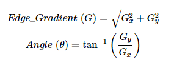
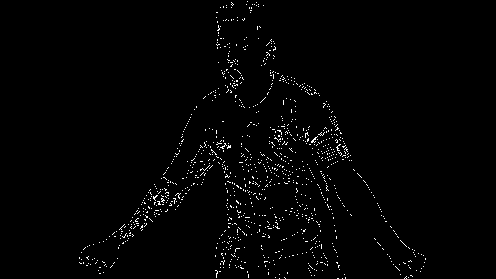

# Edge Detection (Canny Edge Detection)

> The Canny edge detector is an edge detection operator that detects a wide range of edges in images using a multi-stage algorithm. It was created in 1986 by John F. Canny.

- The different stages of the Canny algorithm are —
    - **Noise Reduction**: Because edge detection is sensitive to image noise, the first step is to remove the noise with a 5x5 Gaussian filter.
    - **Finding the Image's Intensity Gradient**: The smoothed image is then filtered in both the horizontal and vertical directions with a Sobel kernel to obtain the first derivative in both the horizontal (Gx) and vertical (Vx) directions (Gy). We can find the edge gradient and direction for each pixel using these two images:

        

    - **Non-maximum Suppression**: After obtaining the gradient magnitude and direction, the image is fully scanned to remove any unwanted pixels that do not form the edge. For this, each pixel is checked to see if it is a local maximum in its neighbourhood in the gradient direction.
    - **Hysteresis Thresholding**: This stage determines which edges are genuine and which are not. We'll need two threshold values, minThres and maxThres, for this. Any edges with an intensity gradient greater than maxThres are certain to be edges, while those with an intensity gradient less than minThres are certain to be non-edges, and should be discarded. Based on their connectivity, those who fall between these two thresholds are classified as edges or non-edges. They are considered to be part of edges if they are connected to "sure-edge" pixels. Otherwise, they are discarded as well.

> All of the above is combined into a single function, cv2.Canny(), in OpenCV (). Our input image is the first argument. Our minThres and maxThres arguments are the second and third arguments, respectively. Aperture size is the third argument. It refers to the size of the Sobel kernel that is used to locate image gradients. It is set to 3 by default. The last argument is L2gradient, which specifies the gradient magnitude equation. If True, it uses the more accurate equation mentioned above; otherwise, it uses this function: Edge Gradient (G)=|Gx|+|Gy|. It is False by default.

- **Explaining the Code**

    > Firstly, we input the sample image from the user and grayscale it.

    ```python
    import cv2 #Importing the OpenCV library
    src = cv2.imread("sample.jpg",cv2.IMREAD_UNCHANGED) #Loading the source image
    cv2.imshow(img) #Displaying the input image
    ```

    

    > *Google Colab does not support cv2.imshow(<image>). Instead use*

    ```python
    from google.colab.patches import cv2_imshow
    cv2_imshow(img) #Does the same work as cv2.imshow(img)
    ```

    > Because all edge detection results are easily influenced by image noise, it is critical to filter out the noise to avoid false detection. A Gaussian filter kernel is convolved with the image to smooth it out. This step smoothers the image slightly to reduce the effects of visible noise on the edge detector.

    ```python
    img = cv2.cvtColor(src,cv2.COLOR_BGR2GRAY) #Grayscaling the Image
    img_blur = cv2.GaussianBlur(img, (5, 5), 0) #Masking the Image
    cv2_imshow(img_blur)
    ```

    

    > We try to calculate some healthy threshold values with the help of the median pixel value from the numpy array (image). Then, we call the cv2.Canny() function and experiment with our output by altering these threshold values.

    ```python
    minThres = max(0, 0.7 * np.median(img)) #Estimating the Lower Threshold
    maxThres = min(255,1.3 * np.median(img)) #Estimating the Upper Threshold
    edges = cv2.Canny(img_blur, minThres+50, maxThres+50)
    cv2_imshow(edges)
    ```

    
