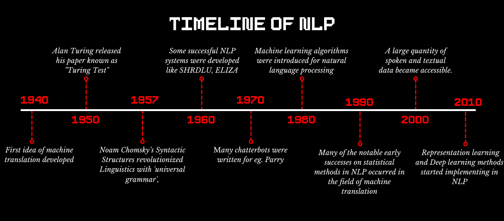

   

  
  
   
  
  <b><center> This mark file down demonstrates that background work of NLP</b> </center>
  

### 📋INTRODUCTION To NLP

### 1.What is Natural Language processing ❓

<p> Natural language processing (NLP) is a branch of artificial intelligence that helps computers understand, interpret and manipulate human language. NLP draws from many disciplines, including computer science and computational linguistics, in its pursuit to fill the gap between human communication and computer understanding.
<p> NLP combines computational linguistics—rule-based modeling of human language—with statistical, machine learning, and deep learning models. Together, these technologies enable computers to process human language in the form of text or voice data and to ‘understand’ its full meaning, complete with the speaker or writer’s intent and sentiment. 
<p> NLP drives computer programs that translate text from one language to another, respond to spoken commands, and summarize large volumes of text rapidly—even in real time. There’s a good chance you’ve interacted with NLP in the form of voice-operated GPS systems, digital assistants, speech-to-text dictation software, customer service chatbots, and other consumer conveniences. But NLP also plays a growing role in enterprise solutions that help streamline business operations, 
  increase employee productivity, and simplify mission-critical business processes.
  


  
  
  
 ### 2.Where we can use the natural language processing ❓
  <p> Natural language processing (NLP) describes the interaction between human language and computers. It’s a technology that many people use daily and has been around for years, but is often taken for granted.

A few examples of NLP that people use every day are:

Spell check,
Autocomplete,
Voice text messaging,
Spam filters,
Related keywords on search engines,
Siri, Alexa, or Google Assistant.
    
<p> In any case, the computer is able to identify the appropriate word, phrase, or response by using context clues, the same way that any human would. Conceptually, it’s a fairly straightforward technology.

<p> Where NLP outperforms humans is in the amount of language and data it’s able to process. Therefore, its potential uses go beyond the examples above and make possible tasks that would’ve otherwise taken employees months or years to accomplish.
  

  ### 3. History and Background work of NLP ❓
  
  

<p> While natural language processing isn’t a new science, the technology is rapidly advancing thanks to an increased interest in human-to-machine communications, plus an availability of big data, powerful computing and enhanced algorithms. 

<p> As a human, you may speak and write in English, Spanish or Chinese. But a computer’s native language – known as machine code or machine language – is largely incomprehensible to most people. At your device’s lowest levels, communication occurs not with words but through millions of zeros and ones that produce logical actions. 

<p> Indeed, programmers used punch cards to communicate with the first computers 70 years ago. This manual and arduous process was understood by a relatively small number of people. Now you can say, “Alexa, I like this song,” and a device playing music in your home will lower the volume and reply, “OK. Rating saved,” in a humanlike voice. Then it adapts its algorithm to play that song – and others like it – the next time you listen to that music station. 

<p> Let’s take a closer look at that interaction. Your device activated when it heard you speak, understood the unspoken intent in the comment, executed an action and provided feedback in a well-formed English sentence, all in the space of about five seconds. The complete interaction was made possible by NLP, along with other AI elements such as machine learning and deep learning. 

  ### Why is NLP important ❔
   
 ### Large volumes of textual data
<p> Natural language processing helps computers communicate with humans in their own language and scales other language-related tasks. For example, NLP makes it possible for computers to read text, hear speech, interpret it, measure sentiment and determine which parts are important. 
Today’s machines can analyze more language-based data than humans, without fatigue and in a consistent, unbiased way. Considering the staggering amount of unstructured data that’s generated every day, from medical records to social media, automation will be critical to fully analyze text and speech data efficiently.

### Structuring a highly unstructured data source
<p> Human language is astoundingly complex and diverse. We express ourselves in infinite ways, both verbally and in writing. Not only are there hundreds of languages and dialects, but within each language is a unique set of grammar and syntax rules, terms and slang. When we write, we often misspell or abbreviate words, or omit punctuation. When we speak, we have regional accents, and we mumble, stutter and borrow terms from other languages. 
While supervised and unsupervised learning, and specifically deep learning, are now widely used for modeling human language, there’s also a need for syntactic and semantic understanding and domain expertise that are not necessarily present in these machine learning approaches. NLP is important because it helps resolve ambiguity in language and adds useful numeric structure to the data for many downstream applications, such as speech recognition or text analytics. 


  
 ### NLP methods and applications
  
  #### How computers make sense of textual data

  NLP and text analytics

<p> Natural language processing goes hand in hand with text analytics, which counts, groups and categorizes words to extract structure and meaning from large volumes of content. Text analytics is used to explore textual content and derive new variables from raw text that may be visualized, filtered, or used as inputs to predictive models or other statistical methods.

 <p> NLP and text analytics are used together for many applications, including:
     Investigative discovery. Identify patterns and clues in emails or written reports to help detect and solve crimes.
     Subject-matter expertise. Classify content into meaningful topics so you can take action and discover trends.
     Social media analytics. Track awareness and sentiment about specific topics and identify key influencers. 
  
  #### Everyday NLP examples 

<p>There are many common and practical applications of NLP in our everyday lives. Beyond conversing with virtual assistants like Alexa or Siri, here are a few more examples: 
<p>Have you ever looked at the emails in your spam folder and noticed similarities in the subject lines? You’re seeing Bayesian spam filtering, a statistical NLP technique that compares the words in spam to valid emails to identify junk mail.
<p>Have you ever missed a phone call and read the automatic transcript of the voicemail in your email inbox or smartphone app? That’s speech-to-text conversion, an NLP capability.
<p>Have you ever navigated a website by using its built-in search bar, or by selecting suggested topic, entity or category tags? Then you’ve used NLP methods for search,
  topic modeling, entity extraction and content categorization.
  
  
 #### How does NLP work?
Breaking down the elemental pieces of language
  
<p> Natural language processing includes many different techniques for interpreting human language, ranging from statistical and machine learning methods to rules-based and algorithmic approaches. We need a broad array of approaches because the text- and voice-based data varies widely, as do the practical applications. 

<p>Basic NLP tasks include tokenization and parsing, lemmatization/stemming, part-of-speech tagging, language detection and identification of semantic relationships. If you ever diagramed sentences in grade school, you’ve done these tasks manually before. In general terms, NLP tasks break down language into shorter, elemental pieces, try to understand relationships between the pieces and explore how the pieces work together to create meaning.

<p>These underlying tasks are often used in higher-level NLP capabilities, such as:

   #### Content categorization. 
 <p> A linguistic-based document summary, including search and indexing, content alerts and duplication detection.

   #### Topic discovery and modeling.
 <p>  Accurately capture the meaning and themes in text collections, and apply advanced analytics to text, like optimization and forecasting.

   #### Contextual extraction. 
 <p> Automatically pull structured information from text-based sources.

   #### Sentiment analysis. 
  <p> Identifying the mood or subjective opinions within large amounts of text, including average sentiment and opinion mining. 

   #### Speech-to-text and text-to-speech conversion. 
  <p> Transforming voice commands into written text, and vice versa. 

   #### Document summarization.
 <p> Automatically generating synopses of large bodies of text.

   #### Machine translation. 
 <p> Automatic translation of text or speech from one language to another.

In all these cases, the overarching goal is to take raw language input and use linguistics and algorithms to transform or enrich the text in such a way that it delivers greatervalue
   

   
   
   ### 📋 8 Natural Language Processing (NLP) Examples
   
 * Email filters
<p> Email filters are one of the most basic and initial applications of NLP online. It started out with spam filters, uncovering certain words or phrases that signal a spam message. But filtering has upgraded, just like early adaptations of NLP.
One of the more prevalent, newer applications of NLP is found in Gmail's email classification. The system recognizes if emails belong in one of three categories (primary, social, or promotions) based on their contents. For all Gmail users, this keeps your inbox to a manageable size with important, relevant emails you wish to review and respond to quickly.

 * Smart assistants
<p> Smart assistants like Apple’s Siri and Amazon’s Alexa recognize patterns in speech thanks to voice recognition, then infer meaning and provide a useful response. We’ve become used to the fact that we can say “Hey Siri,” ask a question, and she understands what we said and responds with relevant answers based on context. And we’re getting used to seeing Siri or Alexa pop up throughout our home and daily life as we have conversations with them through items like the thermostat, light switches, car, and more.
We now expect assistants like Alexa and Siri to understand contextual clues as they improve our lives and make certain activities easier like ordering items, and even appreciate when they respond humorously or answer questions about themselves. Our interactions will grow more personal as these assistants get to know more about us. As a New York Times article “Why We May Soon Be Living in Alexa’s World,” explained: “Something bigger is afoot. Alexa has the best shot of becoming the third great consumer computing platform of this decade.”

* Search results
<p> Search engines use NLP to surface relevant results based on similar search behaviors or user intent so the average person finds what they need without being a search-term wizard.
For example, Google not only predicts what popular searches may apply to your query as you start typing, but it looks at the whole picture and recognizes what you’re trying to say rather than the exact search words. Someone could put a flight number in Google and get the flight status, type a ticker symbol and receive stock information, or a calculator might come up when inputting a math equation. These are some variations you may see when completing a search as NLP in search associates the ambiguous query to a relative entity and provides useful results.

* Predictive text
<p> Things like autocorrect, autocomplete, and predictive text are so commonplace on our smartphones that we take them for granted. Autocomplete and predictive text are similar to search engines in that they predict things to say based on what you type, finishing the word or suggesting a relevant one. And autocorrect will sometimes even change words so that the overall message makes more sense.
They also learn from you. Predictive text will customize itself to your personal language quirks the longer you use it. This makes for fun experiments where individuals will share entire sentences made up entirely of predictive text on their phones. The results are surprisingly personal and enlightening; they’ve even been highlighted by several media outlets.

* Language translation
<p> One of the tell-tale signs of cheating on your Spanish homework is that grammatically, it’s a mess. Many languages don’t allow for straight translation and have different orders for sentence structure, which translation services used to overlook. But, they’ve come a long way.
With NLP, online translators can translate languages more accurately and present grammatically-correct results. This is infinitely helpful when trying to communicate with someone in another language. Not only that, but when translating from another language to your own, tools now recognize the language based on inputted text and translate it.

* Digital phone calls
<p> We all hear “this call may be recorded for training purposes,” but rarely do we wonder what that entails. Turns out, these recordings may be used for training purposes, if a customer is aggrieved, but most of the time, they go into the database for an NLP system to learn from and improve in the future. Automated systems direct customer calls to a service representative or online chatbots, which respond to customer requests with helpful information. This is a NLP practice that many companies, including large telecommunications providers have put to use.
NLP also enables computer-generated language close to the voice of a human. Phone calls to schedule appointments like an oil change or haircut can be automated, as evidenced by this video showing Google Assistant making a hair appointment.

* Data analysis
<p> Natural language capabilities are being integrated into data analysis workflows as more BI vendors offer a natural language interface to data visualizations. One example is smarter visual encodings, offering up the best visualization for the right task based on the semantics of the data. This opens up more opportunities for people to explore their data using natural language statements or question fragments made up of several keywords that can be interpreted and assigned a meaning.
Applying language to investigate data not only enhances the level of accessibility, but lowers the barrier to analytics across organizations, beyond the expected community of analysts and software developers.
To learn more about how natural language can help you better visualize and explore your data, check out this webinar.

* Text analytics
<p> Text analytics converts unstructured text data into meaningful data for analysis using different linguistic, statistical, and machine learning techniques.
While sentiment analysis sounds daunting to brands--especially if they have a large customer base--a tool using NLP will typically scour customer interactions, such as social media comments or reviews, or even brand name mentions to see what’s being said. Analysis of these interactions can help brands determine how well a marketing campaign is doing or monitor trending customer issues before they decide how to respond or enhance service for a better customer experience.
Additional ways that NLP helps with text analytics are keyword extraction and finding structure or patterns in unstructured text data.
There are vast applications of NLP in the digital world and this list will grow as businesses and industries embrace and see its value. While a human touch is important for more intricate communications issues, NLP will improve our lives by managing and automating smaller tasks first and then complex ones with technology innovation.
   
  . 

### Libraries in NLP

Natural Language Processing(NLP), a field of AI, aims to understand the semantics and connotations of natural human languages. It focuses on extracting meaningful information from text and train data models based on the acquired insights. The primary NLP functions include text mining, text classification, text analysis, sentiment analysis, word sequencing, speech recognition & generation, machine translation, and dialog systems, to name a few. 
Thanks to the development of useful NLP libraries, today, NLP is finding applications across the various parallels of the industrial landscape. In fact, NLP has now become an integral part of Deep Learning development. Extracting valuable information from free text is essential for developing chatbots, patent research & analysis, voice/speech recognition, patient data processing, and querying image content, among other use cases of NLP.
The fundamental aim of NLP libraries is to simplify text preprocessing. A good NLP library should be able to correctly convert free text sentences into structured features (for example, cost per hour) that can easily be fed into ML or DL pipelines. Also, an NLP library should have a simple-to-learn API, and it must be able to implement the latest and greatest algorithms and models efficiently. 
Although there are numerous NLP libraries designed for specific NLP applications, today, we’re going to draw a comparison of the functions of the top NLP libraries in Python. 


Now, let’s dive into the discussion about the top NLP libraries!


1. Natural Language Toolkit (NLTK)
2. Gensim
3. CoreNLP
4. spaCy
5. TextBlob


### 1.Natural Language Toolkit (NLTK)
NLTK is one of the leading platforms for building Python programs that can work with human language data. 
It presents a practical introduction to programming for language processing. NLTK comes with a host of text processing libraries for 
sentence detection, tokenization, lemmatization, stemming, parsing, chunking, and POS tagging. 


NLTK provides easy-to-use interfaces to over 50 corpora and lexical resources. 
The tool has the essential functionalities required for almost all kinds of natural language processing tasks with Python.

### Installation
 * pip install nltk
 .png)
 

### Features


*   Stemming
*   Recommendation
*   Sentiment analysis
*   Translation


### 2.Gensim
Gensim is a Python library designed specifically for “topic modeling, document indexing, and similarity retrieval with large corpora.”
All algorithms in Gensim are memory-independent, w.r.t., the corpus size, and hence, it can process input larger than RAM. With intuitive interfaces, Gensim allows for efficient multicore implementations of popular algorithms, including online Latent Semantic Analysis (LSA/LSI/SVD), Latent Dirichlet Allocation (LDA), Random Projections (RP), Hierarchical Dirichlet Process (HDP) or word2vec deep learning. 


Gensim features extensive documentation and Jupyter Notebook tutorials. It largely depends on NumPy and SciPy for scientific computing. 
Thus, you must install these two Python packages before installing Gensim.

  * Gensim is an open-source vector space and topic modelling toolkit.
  * Gensim uses numpy and sciPy.
  * Gensim is designed for data stemming ,habdle large text collections and efficient incremental algorithms.
  
 ### Installation
  
  * pip install gensim
  .png)
 

 
 ### Features
  
  * FastText
  * Word2Vec
  * Latent Semantic Analysis 
  * Latent dirichlet Allocation
  * tf-idf ( Term frequency-inverse document frequency)


### 3. CoreNLP
Stanford CoreNLP comprises of an assortment of human language technology tools. It aims to make the application of linguistic analysis tools to a piece of text easy and efficient. With CoreNLP, you can extract all kinds of text properties (like named-entity recognition, part-of-speech tagging, etc.) in only a few lines of code. 

Since CoreNLP is written in Java, it demands that Java be installed on your device. However, 
it does offer programming interfaces for many popular programming languages, including Python. 
The tool incorporates numerous Stanford’s NLP tools like the parser, sentiment analysis, bootstrapped pattern learning, part-of-speech (POS) tagger, 
named entity recognizer (NER), and coreference resolution system, to name a few. Furthermore, CoreNLP supports four languages apart from 
English – Arabic, Chinese, German, French, and Spanish.

### Installation
  * pip install stanford-corenlp
 .png)
 
### Features
  * Lemmatization
  * Part-Of-Speech Tagging
  * Morphological Tagging
  * Named ENtity Recognition
  * Tokenization
  * Sentence Splitting

  

### 4.spaCy

spaCy is an open-source NLP library in Python. It is designed explicitly for production usage – it lets you develop applications that process and understand huge volumes of text.  

spaCy can preprocess text for Deep Learning. It can be be used to build natural language understanding systems or information extraction systems. 
spaCy is equipped with pre-trained statistical models and word vectors. It can support tokenization for over 49 languages. 
spaCy boasts of state-of-the-art speed, parsing, named entity recognition, convolutional neural network models for tagging, and deep learning integration.


### Installation
  * pip install -U spacy
  * .png)

### Features
  * Tokenization
  * POS Tagging 
  * Dependency Parsing
  * Lemmatization
  * Sentence Boundary Detection
  * Named Entity Recognition
  * Entity Linking
  * Text Classification
  * Similarity
  


### 5.TextBlob

TextBlob is a Python (2 & 3) library designed for processing textual data. It focuses on providing access to common text-processing operations through familiar interfaces. TextBlob objects can be treated as Python strings that are trained in Natural Language Processing.

TextBlob offers a neat API for performing common NLP tasks like part-of-speech tagging, noun phrase extraction, sentiment analysis, classification, language translation, 
word inflection, parsing, n-grams, and WordNet integration.
### Installation
 
   * pip install -U tectblob
   * python _m textblob.download_corpora
  
### Features
   * Tokenization
   * Parsing
   * Spelling Corrrection
   * Sentiment Analysis
   * Part-Of_Speech tagging
   * n-grams
   * Translation
   * word & phrase frequencies
   

### 6.Pattern

Pattern is a text processing, web mining, natural language processing, machine learning, and network analysis tool for Python. It comes with a host of tools for data mining (Google, Twitter, Wikipedia API, a web crawler, and an HTML DOM parser), NLP (part-of-speech taggers, n-gram search, sentiment analysis, WordNet), 
ML (vector space model, clustering, SVM), and network analysis by graph centrality and visualization. 
### Installation
 
   * pip install pattern
   * .png)
   
   
   ## Practical Implementation
   
   
*  import nltk
*  from nltk.stem import PorterStemmer
*  word_stemmer = PorterStemmer()
*  word_stemmer.stem('eating')
   
   


*  import nltk
*  from nltk.stem import PorterStemmer
*  word_stemmer = PorterStemmer()
*  word_stemmer.stem('writing')
   
  
   
   
   
   ## Lancaster stemming algorithm
   
   
It was developed at Lancaster University and it is another very common stemming algorithms.

LancasterStemmer class NLTK has LancasterStemmer class with the help of which we can easily implement Lancaster Stemmer algorithms for the word we want to stem. Let us see an example −
   
   ### First, we need to import the natural language toolkit(nltk).
   
*  import nltk
*  from nltk.stem import PorterStemmer
*  word_stemmer = PorterStemmer()
*  word_stemmer.stem('eats')
   
   
   
   
   
## Regular Expression stemming algorithm
   
With the help of this stemming algorithm, we can construct our own stemmer.

RegexpStemmer class NLTK has RegexpStemmer class with the help of which we can easily implement Regular Expression Stemmer algorithms. It basically takes a single regular expression and removes any prefix or suffix that matches the expression. Let us see an example −

### First, we need to import the natural language toolkit(nltk).
   
*  import nltk
*  from nltk.stem import RegexpStemmer
*  Reg_stemmer = RegexpStemmer("ing")
*  Reg_stemmer.stem('eating')
   
   
   
   
   
## Snowball stemming algorithm
   
It is another very useful stemming algorithm.

SnowballStemmer class NLTK has SnowballStemmer class with the help of which we can easily implement Snowball Stemmer algorithms. It supports 15 non-English languages. In order to use this steaming class, we need to create an instance with the name of the language we are using and then call the stem() method. Let us see an example −
   
   
   ### First, we need to import the natural language toolkit(nltk)
   
*  import nltk
*  from nltk.stem import SnowballStemmer
*  SnowballStemmer.languages
   
   
   
   
   
*  import nltk
*  from nltk.stem import SnowballStemmer
*  French_stemmer = SnowballStemmer("french")
*  French_stemmer.stem ("Bonjoura")
   
   

   
   
  ## What is Lemmatization?
   
Lemmatization technique is like stemming. The output we will get after lemmatization is called ‘lemma’, which is a root word rather than root stem, the output of stemming. After lemmatization, we will be getting a valid word that means the same thing.

NLTK provides WordNetLemmatizer class which is a thin wrapper around the wordnet corpus. This class uses morphy() function to the WordNet CorpusReader class to find a lemma. Let us understand it with an example 
   
   ### First, we need to import the natural language toolkit(nltk).
   
*  import nltk
*  nltk.download('wordnet')
*  from nltk.stem import WordNetLemmatizer
  
   

   ## Create WordNetLemmatizer object
*  wnl = WordNetLemmatizer()
  
*  ### Single word lemmatization examples
*  list1 = ['kites', 'babies', 'dogs', 'flying', 'smiling', 'driving', 'died', 'tried', 'feet']
*  for words in list1:
    print(words + " ---> " + wnl.lemmatize(words))
   
   
   
   
   
   ## TextBlob
   
TextBlob is a python library used for processing textual data. It provides a simple API to access its methods and perform basic NLP tasks. Download TextBlob package : In your anaconda prompt or terminal, type: pip install textblob
   
*  from textblob import TextBlob
*  wiki = TextBlob("Python is a high-level, general-purpose programming language.")
   
   
   
## Sentiment Analysis
   
The sentiment property returns a namedtuple of the form Sentiment(polarity, subjectivity). The polarity score is a float within the range [-1.0, 1.0]. The subjectivity is a float within the range [0.0, 1.0] where 0.0 is very objective and 1.0 is very subjective.
   
   
*  testimonial = TextBlob("Textblob is amazingly simple to use. What great fun!")

*  testimonial.sentiment

*  Sentiment(polarity=0.39166666666666666, subjectivity=0.4357142857142857)

*  testimonial.sentiment.polarity
   
   
   
   
   
   
   
   
   


   
   
   

   # **Introduction to Numpy**

### What is Numpy ?
* NumPy is the fundamental package for scientific computing in Python. It is a Python library that provides a multidimensional array object, 
various derived objects (such as masked arrays and matrices), and an assortment of routines for fast operations on arrays, including mathematical, logical, shape manipulation, 
sorting, selecting, I/O, discrete Fourier transforms, basic linear algebra, basic statistical operations, random simulation and much more.

* Our Python NumPy Tutorial provides the basic and advanced concepts of the NumPy. Our NumPy tutorial is designed for beginners and professionals.
NumPy stands for numeric python which is a python package for the computation and processing of the multidimensional and single dimensional array elements.

* Travis Oliphant created NumPy package in 2005 by injecting the features of the ancestor module Numeric into another module Numarray.
It is an extension module of Python which is mostly written in C. It provides various functions which are capable of performing the numeric computations with a high speed.
NumPy provides various powerful data structures, implementing multi-dimensional arrays and matrices. These data structures are used for the optimal computations regarding
arrays and matrices.

### The need of NumPy
With the revolution of data science, data analysis libraries like NumPy, SciPy, Pandas, etc. have seen a lot of growth. With a much easier syntax than other programming languages, python is the first choice language for the data scientist.
NumPy provides a convenient and efficient way to handle the vast amount of data. NumPy is also very convenient with Matrix multiplication and data reshaping. NumPy is fast which makes it reasonable to work with a large set of data.

There are the following advantages of using NumPy for data analysis.

* NumPy performs array-oriented computing.
* It efficiently implements the multidimensional arrays.
* It performs scientific computations.
* It is capable of performing Fourier Transform and reshaping the data stored in multidimensional arrays.
* NumPy provides the in-built functions for linear algebra and random number generation.
* Nowadays, NumPy in combination with SciPy and Mat-plotlib is used as the replacement to MATLAB as Python is more complete and easier programming language than MATLAB.

### NumPy Environment Setup
NumPy doesn't come bundled with Python. We have to install it using the python pip installer. Execute the following command.
```
pip install numpy
 ```
 
  
 ### Data Types in Numpy

* i - Integer
* b - Boolean
* u - Unsigned Integer
* f - Float
* c - Complex Float
* m - Timedelta
* M - Datetime
* O - Object
* S - String 
* U - Unicode String
* V - Fixed chunk of memory for other type


 ### numpy.concatenate() in Python
The concatenate() function is a function from the NumPy package. This function essentially combines NumPy arrays together. This function is basically used for joining two or more arrays of the same shape along a specified axis. There are the following things which are essential to keep in mind:

NumPy's concatenate() is not like a traditional database join. It is like stacking NumPy arrays. This function can operate both vertically and horizontally. This means we can concatenate arrays together horizontally or vertically. numpy.concatenate() The concatenate() function is usually written as np.concatenate(), but we can also write it as numpy.concatenate(). It depends on the way of importing the numpy package, either import numpy as np or import numpy, respectively.


import numpy as np  
x=np.array([[1,2],[3,4]])  
y=np.array([[12,30]])  
z=np.concatenate((x,y))  
z  
```
   array([[ 1,  2],
       [ 3,  4],
       [12, 30]])
   ```

### numpy.concatenate() with axis=0
import numpy as np  
x=np.array([[1,2],[3,4]])  
y=np.array([[12,30]])  
z=np.concatenate((x,y), axis=0)  
z  
```
   array([[ 1,  2],
       [ 3,  4],
       [12, 30]])
   ```

### numpy.concatenate() with axis=1
import numpy as np  
x=np.array([[1,2],[3,4]])  
y=np.array([[12,30]])  
z=np.concatenate((x,y.T), axis=1)  
z  
```
   array([[ 1,  2, 12],
       [ 3,  4, 30]])
   ```

### numpy.concatenate() with axis=None
import numpy as np  
x=np.array([[1,2],[3,4]])  
y=np.array([[12,30]])  
z=np.concatenate((x,y), axis=None)  
z  
```
   array([ 1,  2,  3,  4, 12, 30])
   
   ```

### numpy.append() in Python
The numpy.append() function is available in NumPy package. As the name suggests, append means adding something. The numpy.append() function is used to add or append new values to an existing numpy array. This function adds the new values at the end of the array.

The numpy append() function is used to merge two arrays. It returns a new array, and the original array remains unchanged.


### np.append()
import numpy as np  
a=np.array([[10, 20, 30], [40, 50, 60], [70, 80, 90]])  
b=np.array([[11, 21, 31], [42, 52, 62], [73, 83, 93]])  
c=np.append(a,b)  
c 
```
   array([10, 20, 30, 40, 50, 60, 70, 80, 90, 11, 21, 31, 42, 52, 62, 73, 83,
       93])
   ```

### np.append({a1,a2,...}, axis=0)
import numpy as np  
a=np.array([[10, 20, 30], [40, 50, 60], [70, 80, 90]])  
b=np.array([[11, 21, 31], [42, 52, 62], [73, 83, 93]])  
c=np.append(a,b,axis=0)  
c  
```
   array([[10, 20, 30],
       [40, 50, 60],
       [70, 80, 90],
       [11, 21, 31],
       [42, 52, 62],
       [73, 83, 93]])
   ```

### np.append({a1,a2,...}, axis=1)
import numpy as np  
a=np.array([[10, 20, 30], [40, 50, 60], [70, 80, 90]])  
b=np.array([[11, 21, 31], [42, 52, 62], [73, 83, 93]])  
c=np.append(a,b,axis=1)  
c  
```
   array([[10, 20, 30, 11, 21, 31],
       [40, 50, 60, 42, 52, 62],
       [70, 80, 90, 73, 83, 93]])
   ```

### numpy.sum() in Python
The numpy.sum() function is available in the NumPy package of Python. This function is used to compute the sum of all elements, the sum of each row, and the sum of each column of a given array. Essentially, this sum ups the elements of an array, takes the elements within a ndarray, and adds them together. It is also possible to add rows and column elements of an array. The output will be in the form of an array object


Syntax
There is the following syntax of numpy.sum() function: numpy.sum(arr, axis=None, dtype=None, out=None, keepdims=, initial=)

  

#import numpy.array()
import numpy as np  
a=np.array([0.4,0.5])  
b=np.sum(a)  
b  

```
   0.9
   ```

import numpy as np  
a=np.array([0.4,0.5,0.9,6.1])  
x=np.sum(a, dtype=np.int32)  
x  
```
   6
   ```


  
   

   # **Introduction to Pandas**

   
Pandas in Python is a package that is written for data analysis and manipulation. Pandas offer various operations and data structures to perform numerical data manipulations and time series. Pandas is an open-source library that is built over Numpy libraries. Pandas library is known for its high productivity and high performance. Pandas is popular because it makes importing and analyzing data much easier.


Pandas programs can be written on any plain text editor like notepad, notepad++, or anything of that sort and saved with a .py extension. To begin with, writing Pandas Codes and performing various intriguing and useful operations, one must have Python installed on their System. This can be done by following the step by step instructions provided below

**Installing Pandas**
   

*  !pip install pandas
   
*  import pandas as pd
   
*  import numpy as np
   
   
   
   


   

## **Pandas Series Data Structure**


Pandas Series is a one-dimensional labeled array capable of holding data of any type (integer, string, float, python objects, etc.). The axis labels are collectively called index. Pandas Series is nothing but a column in an excel sheet. Labels need not be unique but must be a hashable type
   
   
### pd.Series(data,index)
   
**index-> Unique, Hashable, same length as data. By default np.arange(n)**

*  s = pd.Series([1, 2, 3, 4])

*  print(s)
   
   
   
   

   

   
## **Creating Series from Numpy ndarray**

Creating a series from array without index.

In this case as no index is passed, so by default index will be range(n) where n is array length.
   
*  data = np.array([10, 20, 30, 40, 50])

*  s = pd.Series(data)

*  print(s)
   
   
   


   
## **Data accessing using Index**

Indexing in pandas means simply selecting particular rows and columns of data from a DataFrame. Indexing could mean selecting all the rows and some of the columns, some of the rows and all of the columns, or some of each of the rows and columns. Indexing can also be known as Subset Selection.

   
   
   
*  s = pd.Series([1, 2, 3, 4, 5], index=['a', 'b', 'c', 'd', 'e'])

*  print(s)
   
   
   

   
**Retrieve multiple elements**
   

*  print(s[['a', 'b', 'e']])
   
   


   
   
# **Pandas DataFrame**
## **Creating DataFrame using Dictionary**

Pandas DataFrame is a 2-dimensional labeled data structure with columns of potentially different types. It is generally the most commonly used pandas object. 
Pandas DataFrame can be created in multiple ways. Let’s discuss different ways to create a DataFrame one by one.
 
   
   
*  data = {'Name':['Maneesha', 'Anaparthi', 'Rgukt', 'cse'], 'Count':[10,10,1,360]}
   
*  df = pd.DataFrame(data)
   
*  df
   
   
   
   

   
**creating indexed dataframe**
   
   
*  data = {'Name':['Maneesha', 'Anaparthi', 'Rgukt', 'cse'], 'Count':[10,10,1,360]}
   
*  df = pd.DataFrame(data,index = ['index-1','index-2','index-3','index-4'])
   
*  df
   
   
   
   

  
   
   
**creating indexed nan dataframe**
   
   
*  data = {'Name':['Maneesha', 'Anaparthi', np.nan, 'cse'], 'Count':[10,np.nan,1,360]}
   
*  df = pd.DataFrame(data,index = ['index-1','index-2','index-3','index-4'])
   
*  df
   
   
   
   

   
## **dataset.info()**

The info() function is used to print a concise summary of a DataFrame. This method prints information about a DataFrame including the index dtype and column dtypes, non-null values and memory usage. Whether to print the full summary. By default, the setting in pandas
   
   
   
   
   

## **Creating DataFrame using Tuple**

To convert a Python tuple to DataFrame, use the list of tuples and pass that list to a pd. DataFrame() constructor, and it will return a DataFrame. Pandas DataFrame is a two-dimensional, size-mutable, heterogeneous tabular data structure that contains rows and columns
   
   
*  data = [('1/7/2021', 13, 6, 'Rain'),
       ('2/7/2021', 11, 7, 'Fog'),
       ('3/7/2021', 12, 8, 'Sunny'),
       ('4/7/2021', 8, 5, 'Snow'),
       ('5/7/2021', 9, 6, 'Rain')]
   
*  df = pd.DataFrame(data,columns=['Day', 'Temperature', 'WindSpeed', 'Event'])

*  df
   

   
   
   
   
 
### **DataFrame Basic Functionality**

A Series is a one-dimensional labeled array capable of holding any data type (integers, strings, floating point numbers, Python objects, etc.). It has to be remembered that unlike Python lists, a Series will always contain data of the same type.
   
   
## Create Dictionary of Series
   
*  dict = {'Name':pd.Series(['A', 'B', 'C', 'D', 'E', 'F', 'G']),
       'Age':pd.Series([25,26,25,35,23,33,31]),
       'Rating':pd.Series([4.23,4.1,3.4,5,2.9,4.7,3.1])}

*  df = pd.DataFrame(dict)
   
*  df
   
   
   


*  df.values
   
   
   
   
   
  
**head-> by default head returns first 5 rows**
   

*  df.head()
   
   
  
   
   

**tail-> by default tail returns last 5 rows**
   

*  df.tail()
   
   


   
   

 # **Introduction to Neuro Linguistic Programming** 
   
   
   
Neuro-linguistic programming (NLP) is a pseudoscientific approach to communication, personal development, and psychotherapy created by Richard Bandler and John Grinder in California, United States, in the1970s.
Neuro-linguistic Programming (NLP) is one of the most sophisticated and effective methodologies currently available to help you communicate effectively. NLP centres on communication and change. These days everybody needs the skills to develop personal flexibility. Tricks and gimmicks aren’t enough: everyone needs to get real. So welcome to the start of the journey: in this chapter you get a quick taster of the key themes of NLP.
   
   


  
NEUROLOGY The physical components as well as the mental and emotional components of our neurology


LANGUAGE Linguistics pertains to the language that you use, and more specifically, how you communicate with others and more importantly, how you communicate with yourself


FUNCTION Perceiving your mind as your internal operating system, Programming is the way our past experiences, thoughts and emotions affect all areas of our lives


    
   

 ✓ Neuro concerns your neurological system. NLP is based on the idea that you experience the world through your senses and translate sensory information into thought processes, both conscious and unconscious. Thought processes activate the neurological system, which affects physiology, emotions, and behaviour. 

✓ Linguistic refers to the way you use language to make sense of the world, capture and conceptualise experience, and communicate that experience to others. In NLP, linguistics is the study of how the words you speak and your body language influence your experience. 

✓ Programming draws heavily from learning theory and addresses how you code or mentally represent your experiences. Your personal programming consists of your internal processes and strategies (thinking patterns) that you use to make decisions, solve problems, learn, evaluate, and get results. NLP shows you how to recode your experiences and organise your internal programming so that you can get the outcomes

   
 A few quick definitions NLP can be described in various ways. The formal definition is that NLP is ‘the study of the structure of our subjective experience’. Here are a few more ways of answering the elusive question ‘what is NLP?’:
 ✓The art and science of communication 
✓ The key to learning 
✓ The way to understand what makes you and other people tick
 ✓ The route to get the results you want in all areas of your life
 ✓The way to influence others with integrity 
✓  The manual for your brain
 ✓ The secret of successful people
 ✓ The method of creating your own future 
✓ The way to help people make sense of their reality 
✓ The toolkit for personal and organisational change
   

 # **DIFFERENCE BETWEEN NATURAL LANGUAGE PROCESSING AND NEURO LINGUSTIC PROGRAMMING** 
  
   

 NLP stands for natural language processing. It is a part of computer science and artificial intelligence which deals with human languages. NLP also stands for neuro-linguistic programming which is an approach to communication, personal development and psychotherapy.

I found out Natural Language Processing is applied in a lot of our daily activities include but not limited to:

* Automatic Language Translations.
* Speech recognition.
* Grammar and spell check.
* Personal Assistants like Siri, Alexa, and Google Assistant.
* Google suggestions.
* NLP is an integral part of Artificial Intelligence.
   
   


My understanding of Neuro-Linguistic Programming is observing yourself and others and identifying the patterns, models, and physiology we are using and correct it, change it, and remodel it for success.  Neuro-Linguistic Programming is used successfully to develop and enhance some skills which may include but not limited to:

* Effective communication with self and others.
* Rapport building.
* Overcoming Phobias and addictions and bad memories.
* Setting goals and attaining new models.
* Using physiology effectively to create positive shifts.
* Sales and marketing success.
* Identifying ones’ strength and weaknesses
 
### Difference between Natural language and Computer Language
  Natural Language   
* Natural language has a very large vocabulary.
* Natural language is easily understood by humans.
* Natural language is ambiguous in nature.

 Computer Language
* Computer language has a very limited vocabulary.
* Computer language is easily understood by machines.
* Computer language is unambiguous
   
   
 # **SUMMARIZE** 

   To summarize, we compared some features of several popular natural language processing libraries. While most of them provide tools for overlapping tasks, some use unique approaches for specific problems. Definitely, the most popular packages for NLP today are NLTK and Spacy. They are the main competitors in the NLP field. In our opinion, the difference between them lies in the general philosophy of the approach to solving problems.

NLTK is more academic. You can use it to try different methods and algorithms, combine them, etc. 

   Spacy, instead, provides one out-of-box solution for each problem. You don’t have to think about which method is better: the authors of Spacy already took care of this. Also, Spacy is very fast (several times faster than NLTK). One downside is the limited number of languages Spacy supports. However, the number of supported languages is increasing consistently. So, we think that Spacy would be an optimal choice in most cases, but if you want to try something special you can use NLTK.

  
   
With conversational systems steadily becoming the norm, the need for our solutions to recognize our day-to-day speech grows. Natural Language Processing has enabled us to simplify this for the computers and create the next generation of solutions that will be smarter than today's. In this ever-changing world, Python has proved itself to be capable enough to adapt, innovate and deliver solutions to a large variety of modern computational problems that have plagued us in the past.
   
At the moment NLP is battling to detect nuances in language meaning, whether due to lack of context, spelling errors or dialectal differences.

Although the future looks extremely challenging and full of threats for NLP, the discipline is developing at a very fast pace (probably like never before) and we are likely to reach a level of advancement in the coming years that will make complex applications look possible.
