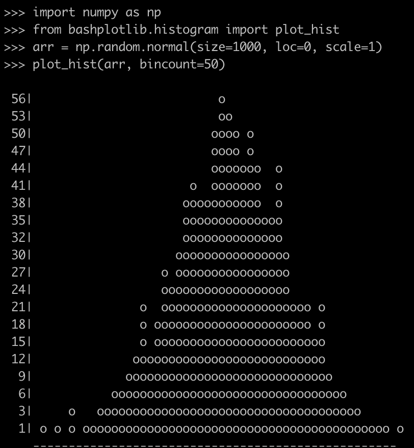

<h1 align="center"> bashplotlib </h1>

<h2 align="center"> This mark down file helps understand "bashplotlib" in PYTHON.</h2>

### 📋 What is bashplotlib?
-------
   - **bashplotlib** is a python package and command line tool for making basic plots in the terminal. It’s a quick way to visualize data when you don’t have a GUI. It’s written in pure python and can quickly be installed anywhere using pip.


### 📋 Installation of bashplotlib: 
-------
#### - Install with pip:
`pip install bashplotlib`
#### - Install from source:
`$ git clone git@github.com:glamp/bashplotlib.git

$ cd bashplotlib

$ python setup.py install`
- Either method will install the bashplotlib python package and will also add hist and scatter to your python scripts folder. This folder should be on your path (add it if it’s not).


### 📋 Features of bashplotlib:
-----

- quick plotting from the command line
- customize the color, size, title, and shape of plots
- pipe data into plots with stdin


### 📋 Usage:
----

#### Command line:
- `hist` takes input from either stdin or specified using the -f parameter. Input should be a single column of numbers.


- `scatter` takes x and y coordinates as input form either a comma delimited file using -f or from 2 different files using -x and -y.


- **If you want to use bashplotlib from python, just import histogram and scatterplot.**


```python
from bashplotlib.scatterplot import plot_scatter
```


```python
from bashplotlib.histogram import plot_hist
```

### Example:
----

*Let’s see an example. In the code below, I imported `numpy` to generate some random arrays, as well as the `bashplotlib`* 


```python
import numpy as np
from bashplotlib.histogram import plot_hist
arr = np.random.normal(size=1000, loc=0, scale=1)
```

`plot_hist` is a function from `bashplotlib` that is for plotting 1-D data in a histogram, just like `plt.hist` does in Matplotlib. Then, we use `Numpy` generated a random array with 1,000 numbers that are normally distributed. After that, we can easily plot this data as follows:


`plot_hist(arr, bincount=50)`


