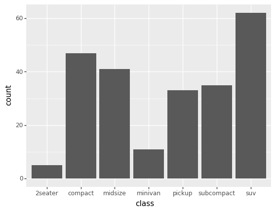

# ggplot
## _Introduction_


### What is ggplot?
`ggplot` is a Python implementation of the grammar of graphics. A grammar of graphics is a high-level tool that allows you to create data plots in an efficient and consistent way. It abstracts most low-level details, letting you focus on creating meaningful and beautiful visualizations for your data.However, if you are a frequent user of Python, then implementing the grammar of graphics can be extremely challenging due to the lack of standardized syntax in popular plotting libraries, such as matplotlib or seaborn. So if you still want to make use of the grammar of graphics, then the Python package `plotnine` provides an alternative for use ggplot.

## Plotnine

<font color=red>plotnine</font> is an alternate Python package which allows us to use ggplot2-like code for implementing the grammar of graphics.By doing so, just as in ggplot2, we are able to specifically map data to visual objects that make up the visualization.

## Installation Process

As we know that there is no inbuilt library for plotnine,so we have to install plotnine.There are two main options for doing so: pip and conda.

 - **Using pip**
 
   pip install plotnine         

- **Using conda**

  conda install -c conda-forge plotnine

## Plotting Data

For plotting data using ggplot,we must have three required components for creating a data visualization using plotline:
- Data
- Aesthetics
- Geometric objects
 
These three different components are combined using the <font color=red> + </font> operator.

### Data

Data is the information to use when creating the plot. In plotnine, we will do this by creating a ggplot object and passing the dataset that we want to use to the constructor.


```python
from plotnine.data import mpg
from plotnine import ggplot

ggplot(mpg)
```


    <ggplot: (-9223371849340713324)>


```python
from plotnine.data import mpg
mpg
```


<div>
<style scoped>
    .dataframe tbody tr th:only-of-type {
        vertical-align: middle;
    }

    .dataframe tbody tr th {
        vertical-align: top;
    }

    .dataframe thead th {
        text-align: right;
    }
</style>
<table border="1" class="dataframe">
  <thead>
    <tr style="text-align: right;">
      <th></th>
      <th>manufacturer</th>
      <th>model</th>
      <th>displ</th>
      <th>year</th>
      <th>cyl</th>
      <th>trans</th>
      <th>drv</th>
      <th>cty</th>
      <th>hwy</th>
      <th>fl</th>
      <th>class</th>
    </tr>
  </thead>
  <tbody>
    <tr>
      <th>0</th>
      <td>audi</td>
      <td>a4</td>
      <td>1.8</td>
      <td>1999</td>
      <td>4</td>
      <td>auto(l5)</td>
      <td>f</td>
      <td>18</td>
      <td>29</td>
      <td>p</td>
      <td>compact</td>
    </tr>
    <tr>
      <th>1</th>
      <td>audi</td>
      <td>a4</td>
      <td>1.8</td>
      <td>1999</td>
      <td>4</td>
      <td>manual(m5)</td>
      <td>f</td>
      <td>21</td>
      <td>29</td>
      <td>p</td>
      <td>compact</td>
    </tr>
    <tr>
      <th>2</th>
      <td>audi</td>
      <td>a4</td>
      <td>2.0</td>
      <td>2008</td>
      <td>4</td>
      <td>manual(m6)</td>
      <td>f</td>
      <td>20</td>
      <td>31</td>
      <td>p</td>
      <td>compact</td>
    </tr>
    <tr>
      <th>3</th>
      <td>audi</td>
      <td>a4</td>
      <td>2.0</td>
      <td>2008</td>
      <td>4</td>
      <td>auto(av)</td>
      <td>f</td>
      <td>21</td>
      <td>30</td>
      <td>p</td>
      <td>compact</td>
    </tr>
    <tr>
      <th>4</th>
      <td>audi</td>
      <td>a4</td>
      <td>2.8</td>
      <td>1999</td>
      <td>6</td>
      <td>auto(l5)</td>
      <td>f</td>
      <td>16</td>
      <td>26</td>
      <td>p</td>
      <td>compact</td>
    </tr>
    <tr>
      <th>...</th>
      <td>...</td>
      <td>...</td>
      <td>...</td>
      <td>...</td>
      <td>...</td>
      <td>...</td>
      <td>...</td>
      <td>...</td>
      <td>...</td>
      <td>...</td>
      <td>...</td>
    </tr>
    <tr>
      <th>229</th>
      <td>volkswagen</td>
      <td>passat</td>
      <td>2.0</td>
      <td>2008</td>
      <td>4</td>
      <td>auto(s6)</td>
      <td>f</td>
      <td>19</td>
      <td>28</td>
      <td>p</td>
      <td>midsize</td>
    </tr>
    <tr>
      <th>230</th>
      <td>volkswagen</td>
      <td>passat</td>
      <td>2.0</td>
      <td>2008</td>
      <td>4</td>
      <td>manual(m6)</td>
      <td>f</td>
      <td>21</td>
      <td>29</td>
      <td>p</td>
      <td>midsize</td>
    </tr>
    <tr>
      <th>231</th>
      <td>volkswagen</td>
      <td>passat</td>
      <td>2.8</td>
      <td>1999</td>
      <td>6</td>
      <td>auto(l5)</td>
      <td>f</td>
      <td>16</td>
      <td>26</td>
      <td>p</td>
      <td>midsize</td>
    </tr>
    <tr>
      <th>232</th>
      <td>volkswagen</td>
      <td>passat</td>
      <td>2.8</td>
      <td>1999</td>
      <td>6</td>
      <td>manual(m5)</td>
      <td>f</td>
      <td>18</td>
      <td>26</td>
      <td>p</td>
      <td>midsize</td>
    </tr>
    <tr>
      <th>233</th>
      <td>volkswagen</td>
      <td>passat</td>
      <td>3.6</td>
      <td>2008</td>
      <td>6</td>
      <td>auto(s6)</td>
      <td>f</td>
      <td>17</td>
      <td>26</td>
      <td>p</td>
      <td>midsize</td>
    </tr>
  </tbody>
</table>
<p>234 rows × 11 columns</p>
</div>


### Aesthetics

Aesthetics provides a mapping between data variables and aesthetic, or graphical, variables used by the underlying drawing system.


```python
from plotnine.data import mpg
from plotnine import ggplot, aes

ggplot(mpg) + aes(x="class", y="hwy")
```


    <ggplot: (-9223371849340666464)>


### Geometric Objects

After defining our data and the attributes that we want to use in the graphic, we need to specify a geometric object to tell plotnine how data points should be drawn.

Plotnine provides a lot of geometric objects that we can use like lines, points, bars, polygons,histogram and a lot more.


```python
from plotnine.data import mpg
from plotnine import ggplot, aes,geom_point

ggplot(mpg) + aes(x="class", y="hwy") + geom_point()
```


    <ggplot: (-9223371849340558816)>


```python
from plotnine.data import mpg
from plotnine import ggplot, aes, geom_bar

ggplot(mpg) + aes(x="class") + geom_bar()
```





    <ggplot: (-9223371849340470656)>


### Some Optional components Of ggplot

<ul>
<li>Statistical : transformations specify computations and aggregations to be applied to the data before plotting it.</li>

<li>Scales : apply some transformation during the mapping from data to aesthetics. For example, sometimes we can use a logarithmic scale to better reflect some aspects of your data.</li>

<li>Facets : allow you to divide data into groups based on some attributes and then plot each group into a separate panel in the same graphic.</li>

<li>Coordinates systems : map the position of objects to a 2D graphical location in the plot. For example, we can choose to flip the vertical and horizontal axes if that makes more sense in the visualization you’re building.</li>

<li>Themes : allows you to control visual properties like colors, fonts, and shapes.</li>
</ul>
